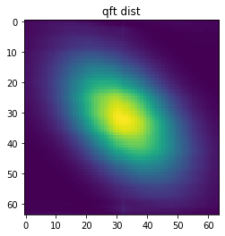

QFTSampler (Quantum Fourier Transform Sampler)
====

## Overview
IntenF/QFTSampler is Random number Sampler using Quantum Fourier Transform.
quantum Fourier Transform (QFT) is simulated with your classical computer at high speed and apply it as a sampler.

## Description
QFTSampler learns an arbitrary target distribution by machine learning and samples it at high speed using QFT.
The sampled random numbers do not necessarily match the target distribution, but can be sampled from a distribution that matches the target distribution by appropriately rejecting/adopting by Metropolis Hasting (MH) method.

## Install

```bash
pip install git+https://github.com/IntenF/QFTSampler.git
```

## Demo

```python
from QFTSampler import Orchestrator
from QFTSampler.transformers import AffineNonLinearBasis, Constant
from QFTSampler.ExpTargetDists import Target_gauss2d_dependent

import matplotlib.pyplot as plt

N = 10 #QFT circuit qubits
M = 4 #Non-zero qubit number of QFT circuit

# make target dist
target = Target_gauss2d_dependent(N=N, M=M, )

# make ML which learns target dist
# ex) Constant: learns constant phi
# ex) AffineNonLinearBasis: learn a linear function that outputs phi using a nonlinear basis
transformer_list = [Constant(M), AffineNonLinearBasis(N,M)]

# Create an orchestrator which samples while learning
orch = Orchestrator(N=N, M=M, trasnsformer_list=transformer_list, target=target)

for _ in range(1000):
  # CE=Cross Entropy
  probs, samples = orch.step(sample_num=32, lr=1e-2, train=True, loss_func='CE')
  #samples: sampled random points
  #probs: probabilities of samples

# visualization of QFT dist which learns target dist
pmap = orch.pmap() #target dist
qmap = orch.qmap() #proposed dist with QFTSampler
plt.title('target dist')
plt.imshow(pmap)
plt.show()
plt.title('qft dist')
plt.imshow(qmap)
plt.show()
```
**outputs**





## Requirement
- Python 3.7
- numpy

### option
- scipy(for expample target distribution (ANPAN))
- ot(to calculate Wasserstein Distance)
- matplotlib(for visualization)
- tqdm(for process visualization)

## Licence
This software is released under the MIT License, see LICENSE.txt.

## Author
- Katsuhiro Endo([umu1729](https://github.com/umu1729))
- Taichi Nakamura([IntenF](https://github.com/IntenF))

This READEME.md was written by reference to this [page](https://deeeet.com/writing/2014/07/31/readme/)
