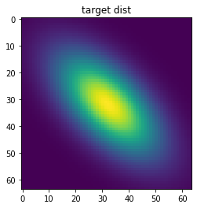
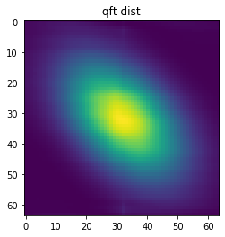

# QFTSampler (Quantum Fourier Transform Sampler)
====

## 概要
IntenF/QFTSampler - 量子フーリエ変換を利用したサンプラー．
量子フーリエ変換(QFT)を古典コンピュータで高速にシミュレートしサンプラーとして応用します．

## 説明
このレポジトリは任意のターゲット分布を機械学習によって学習しQFTを使って高速にサンプリングします．
サンプリングされた乱数は必ずしもターゲット分布と一致しませんが，メトロポリス・ヘイスティング(MH法)によって適切に棄却/採択することでターゲット分布と一致する分布からサンプリングできます．

## デモ

```python
from QFTSampler import Orchestrator
from QFTSampler.transformers import AffineNonLinearBasis, Constant
from QFTSampler.ExpTargetDists import Target_gauss2d_dependent

import matplotlib.pyplot as plt

# NはQFT回路の量子ビット数.乱数の１次元あたりに使うビット数を表す
N = 10
# MはQFT回路の非ゼロqビット数. 作成する分布の周波数を2^Mまでに制限する
M = 4

# ターゲット分布を学習する機械学習器を生成
# ex) Constant: 定数φを学習する
# ex) AffineNonLinearBasis: φを非線形基底を用いて出力する線形関数を学習する
transformer_list = [Constant(M), AffineNonLinearBasis(N,M)]

# ターゲット分布を生成
target = Target_gauss2d_dependent(N=N, M=M, )

# 学習しつつサンプリングするオーケストレーターを作成
orch = Orchestrator(N=N, M=M, trasnsformer_list=transformer_list, target=target)

# 学習しつつサンプリング
for _ in range(1000):
  probs, samples = orch.step(sample_num=32, lr=1e-2, train=True, loss_func='CE')

# 学習した分布を可視化
pmap = orch.pmap() #ターゲット分布
qmap = orch.qmap() #qftsamplerによる提案分布
plt.title('target dist')
plt.imshow(pmap)
plt.show()
plt.title('qft dist')
plt.imshow(qmap)
plt.show()
```
outputs



## 依存環境
- Python 3.7
- numpy

### option
- scipy(for expample target distribution (ANPAN))
- ot(to calculate Wasserstein Distance)
- matplotlib(for visualization)
- tqdm(for process visualization)

## 使い方

## インストール方法

## Licence
This software is released under the MIT License, see LICENSE.txt.

## Author
- Katsuhiro Endo([umu1729](https://github.com/umu1729))
- Taichi Nakamura([IntenF](https://github.com/IntenF))

This READEME_ja.md was wirtten by reference to this [page](https://deeeet.com/writing/2014/07/31/readme/)
